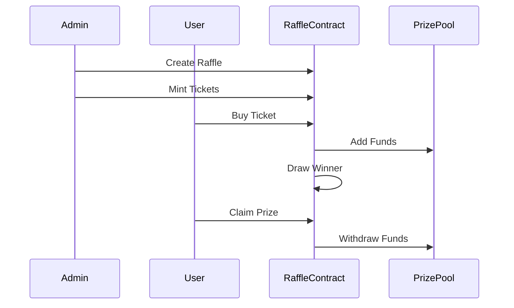
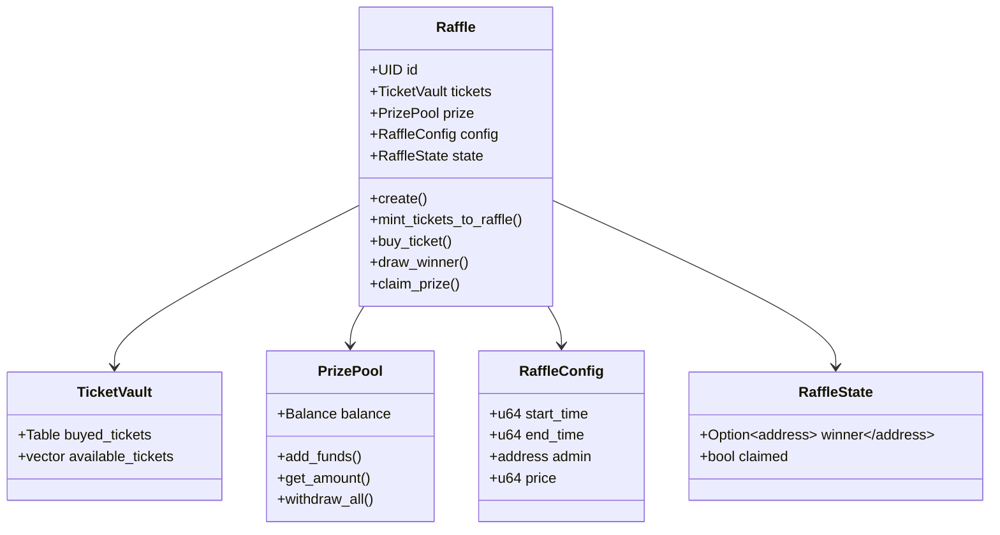

# Aynrand

This is a Raffle architecture for Sui move language using good practices for modularity and separation of concerns, implementing a raffle system based on the lesson from the book of move https://move-book.com/ , and lessons from the paper 
"Building Random, Fair, and Verifiable Games on Blockchain"
https://arxiv.org/pdf/2310.12305

The idea is to implement a raffle system that is random, fair, and verifiable simulating issues and PR like the ones existing in the real world.

The name for Aynrand comes from the idea of randomness and fairness, and the fact that the system is not deterministic, but rather random, also the idea of implement a descentralized DRAND Number generator for a next iteration.

fun fact, the name sounds like a mix of Ayndrand and that was the idea.
## System Architecture

### Sequence Diagram

### Class Diagram

A more detailed diagram can be found in the [docs](docs/state_diagram.md)

## Key Features

- **Lifecycle Management**: Raffles progress through distinct states (NotStarted → Active → Ended → WinnerDrawn)
- **Ticket Management**: Administrators can mint and manage ticket distribution
- **Prize Pool**: Secure handling of SUI tokens for prizes
- **Random Winner Selection**: Uses Sui's Random module for winner selection
- **Prize Claims**: Winners can claim their prizes after drawing

## Technical Details

The system uses Sui Move's object model and implements best practices from:
- [The Move Book](https://move-book.com/)
- ["Building Random, Fair, and Verifiable Games on Blockchain"](https://arxiv.org/pdf/2310.12305)

## ## How It Works 🎪

1. **Admin Creates Raffle** 👨‍💼
   - Sets ticket price
   - Determines number of tickets
   - Initializes the raffle state

2. **Users Buy Tickets** 🎟️
   - Purchase tickets with SUI tokens
   - Tickets give chance to win

3. **Prize Pool Grows** 💰
   - Ticket sales fill prize pool

4. **Winner Selection** 🎲
   - Random selection using Sui's RNG
   - Fair and tamper-proof process
   - Winner automatically determined

5. **Prize Collection** 🏆
   - Winner claims prize
   - Prize pool transferred to winner
   - Raffle state is reset