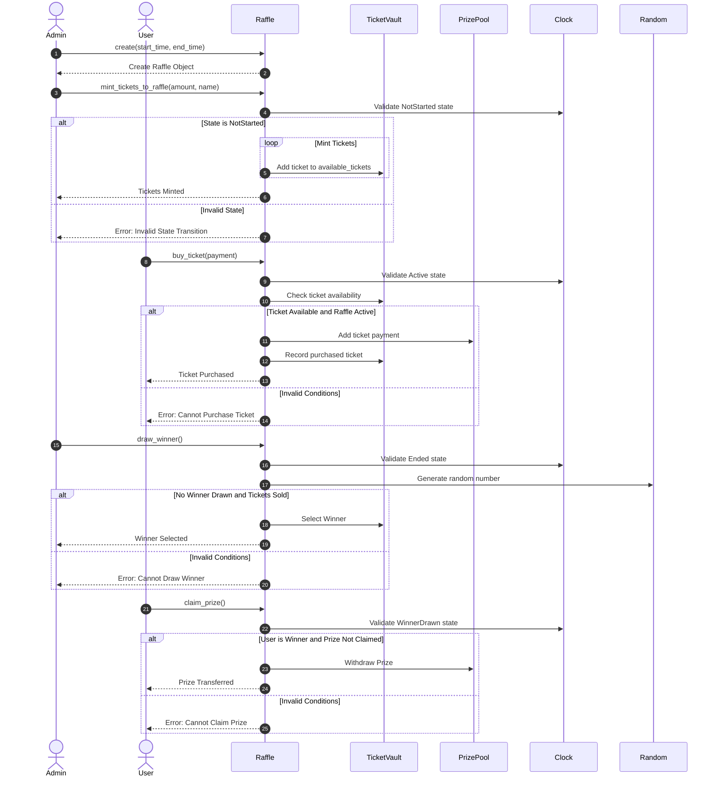

# Secuence Diagram, detailed

```mermaid
sequenceDiagram
    autonumber
    actor Admin
    actor User
    participant Raffle
    participant TicketVault
    participant PrizePool
    participant Clock
    participant Random

    %% Raffle Creation Phase
    Admin->>Raffle: create(start_time, end_time)
    Raffle-->>Admin: Create Raffle Object
    
    %% Ticket Minting Phase
    Admin->>Raffle: mint_tickets_to_raffle(amount, name)
    Raffle->>Clock: Validate NotStarted state
    alt State is NotStarted
        loop Mint Tickets
            Raffle->>TicketVault: Add ticket to available_tickets
        end
        Raffle-->>Admin: Tickets Minted
    else Invalid State
        Raffle-->>Admin: Error: Invalid State Transition
    end

    %% Ticket Purchase Phase
    User->>Raffle: buy_ticket(payment)
    Raffle->>Clock: Validate Active state
    Raffle->>TicketVault: Check ticket availability
    alt Ticket Available and Raffle Active
        Raffle->>PrizePool: Add ticket payment
        Raffle->>TicketVault: Record purchased ticket
        Raffle-->>User: Ticket Purchased
    else Invalid Conditions
        Raffle-->>User: Error: Cannot Purchase Ticket
    end

    %% Winner Drawing Phase
    Admin->>Raffle: draw_winner()
    Raffle->>Clock: Validate Ended state
    Raffle->>Random: Generate random number
    alt No Winner Drawn and Tickets Sold
        Raffle->>TicketVault: Select Winner
        Raffle-->>Admin: Winner Selected
    else Invalid Conditions
        Raffle-->>Admin: Error: Cannot Draw Winner
    end

    %% Prize Claiming Phase
    User->>Raffle: claim_prize()
    Raffle->>Clock: Validate WinnerDrawn state
    alt User is Winner and Prize Not Claimed
        Raffle->>PrizePool: Withdraw Prize
        Raffle-->>User: Prize Transferred
    else Invalid Conditions
        Raffle-->>User: Error: Cannot Claim Prize
    end
```
